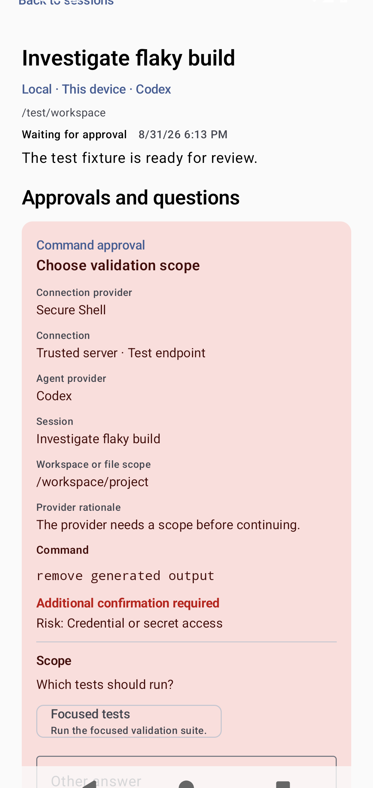
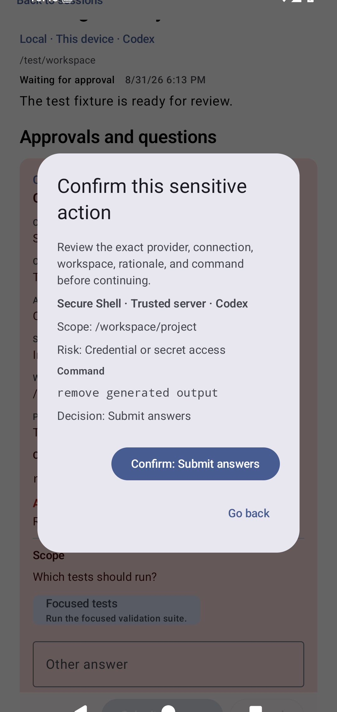
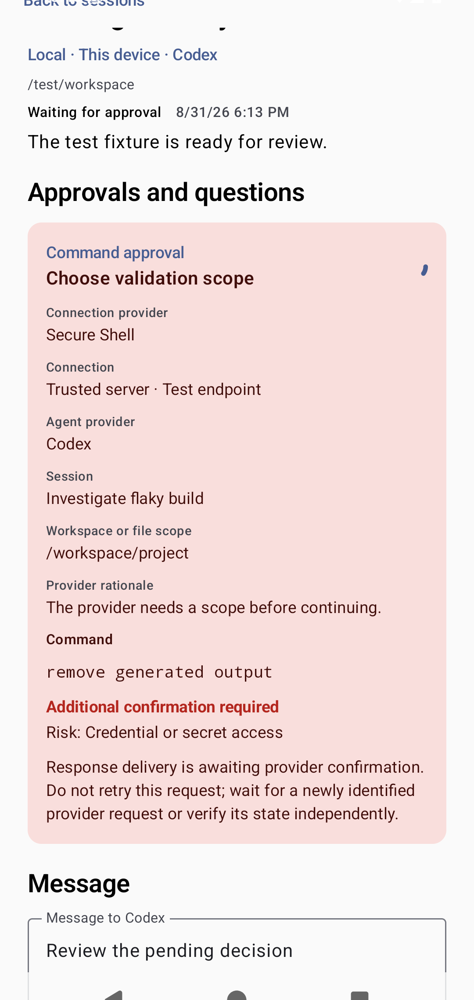

<!-- Generated by scripts/docs/render_workflows.py. Do not edit. -->

# Resolve an agent approval or question

**Status:** Verified by the named Android emulator journey on every pull request and main-branch push.

Move from an attention signal to a scoped, auditable provider response.

## Goal

Answer a provider request once, with enough context to understand its scope and risk.

## Preconditions

- A session is waiting for an approval or provider question.
- The provider supplied the available decisions and question options.

## Handled automatically

- Agent Relay groups the request under Approvals and questions.
- It preserves provider values while showing safe human-readable labels.
- It persists the selected response before delivery and prevents unsafe replay.

## Your attention is needed

- Review the connection, workspace, command, scope, and risk labels.
- Answer every required question.
- Confirm a positive sensitive decision a second time.

## Walkthrough

### 1. Open the attention request

**Action:** Select the session with a pending command approval.

**Expected result:** The request shows its provider, connection, workspace, command, choices, and risk.

### 2. Confirm a sensitive positive response

**Action:** Choose the focused test scope, submit the answer, and review the second confirmation.

**Expected result:** A confirmation dialog repeats the sensitive decision before delivery.

### 3. Avoid duplicate delivery

**Action:** Observe the request while provider confirmation is pending.

**Expected result:** Response controls are unavailable and the app tells the user not to retry.

## Recovery and fault handling

- Cancel or decline when the request is unclear.
- Do not retry a response whose delivery is awaiting provider confirmation.
- Reconnect or inspect the provider before acting on an uncertain result.

## Verification

- Instrumented test: `com.example.agentrelay.ui.main.UsageJourneyTest#capturesVerifiedJourneys`
- Canonical device: Pixel 7 Pro profile, Android API 36
- Locale, time zone, and theme: English (United States), UTC, light theme, normal font scale
- Evidence: reviewed PNG baselines plus current-run captures and image diffs
