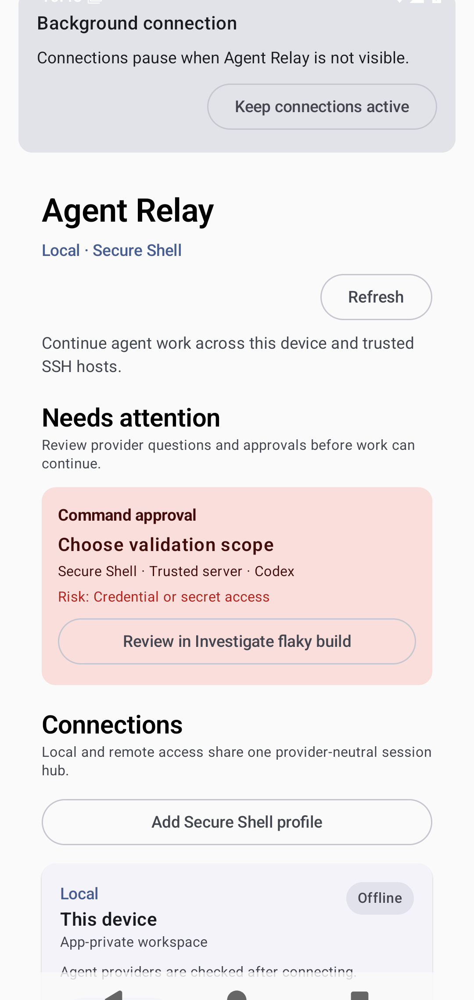

<!-- Generated by scripts/docs/render_workflows.py. Do not edit. -->

# Review what needs attention across hosts

**Status:** Verified by the named Android emulator journey on every pull request and main-branch push.

See exceptional work first while healthy sessions and connections continue quietly.

## Goal

Decide where human attention has the highest value without inspecting every session.

## Preconditions

- Several synthetic connections and sessions have different health and activity states.
- At least one durable event requires a decision.

## Handled automatically

- Agent Relay aggregates unread activity, pending actions, connection failures, and recovery state.
- Quiet healthy work remains available without competing with actionable exceptions.
- Stable identities keep signals attached to the correct host, provider, workspace, and session.

## Your attention is needed

- Open the highest-priority unresolved item.
- Distinguish required action from informational unread activity.
- Dismiss only errors whose underlying condition is understood.

## Walkthrough

### 1. Start with the exceptions

**Action:** Open the session hub after background activity occurs on several synthetic hosts.

**Expected result:** Connections, unread counts, and action counts identify the items that need attention.

## Recovery and fault handling

- Stale resolved requests disappear after durable reconciliation.
- Disconnected hosts retain safe cached context and clear recovery guidance.
- Counts are rebuilt from durable records after process restart.

## Verification

- Instrumented test: `com.example.agentrelay.ui.main.UsageJourneyTest#capturesVerifiedJourneys`
- Canonical device: Pixel 7 Pro profile, Android API 36
- Locale, time zone, and theme: English (United States), UTC, light theme, normal font scale
- Evidence: reviewed PNG baselines plus current-run captures and image diffs
