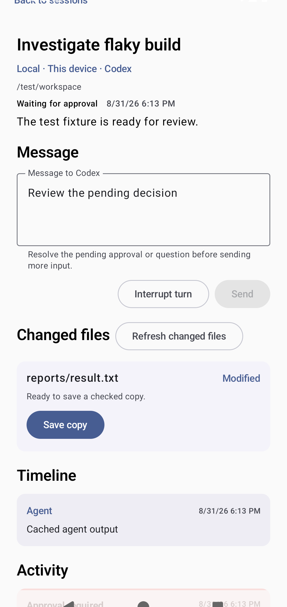
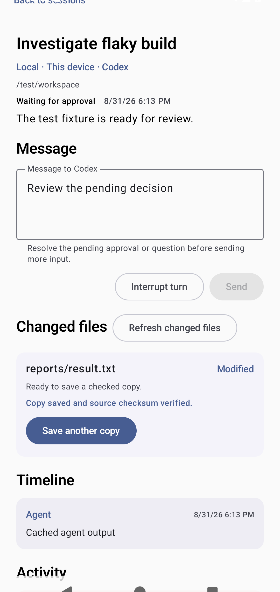

<!-- Generated by scripts/docs/render_workflows.py. Do not edit. -->

# Inspect and save a changed file

**Status:** Verified by the named Android emulator journey on every pull request and main-branch push.

Export one provider-reported workspace file through Android's document picker.

## Goal

Retrieve a changed file without granting broad storage access or following unsafe paths.

## Preconditions

- The selected session reports a changed regular file inside its workspace.
- The connection is online and supports checked file access.

## Handled automatically

- Agent Relay normalizes the relative path and rejects traversal or symlink escapes.
- It records size, modification time, and SHA-256 before streaming bounded chunks.
- Failure or cancellation triggers best-effort removal of a partial destination.

## Your attention is needed

- Verify the safe relative name and availability message.
- Choose the destination in Android's system document picker.
- Confirm the completed row reports source verification.

## Walkthrough

### 1. Review the changed-file shelf

**Action:** Open the selected session and inspect its Changed files section.

**Expected result:** The safe path, change type, and checked-copy availability are visible.

### 2. Confirm the checked copy

**Action:** Select Save copy, choose a destination, and wait for verification.

**Expected result:** The row reports a completed verified export and allows another copy.

## Recovery and fault handling

- Reconnect before saving when the provider is offline.
- Retry from a new destination when the source changed during export.
- Treat deleted and unavailable rows as history, not downloadable files.

## Verification

- Instrumented test: `com.example.agentrelay.ui.main.UsageJourneyTest#capturesVerifiedJourneys`
- Canonical device: Pixel 7 Pro profile, Android API 36
- Locale, time zone, and theme: English (United States), UTC, light theme, normal font scale
- Evidence: reviewed PNG baselines plus current-run captures and image diffs
