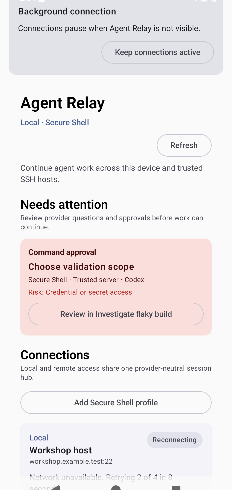
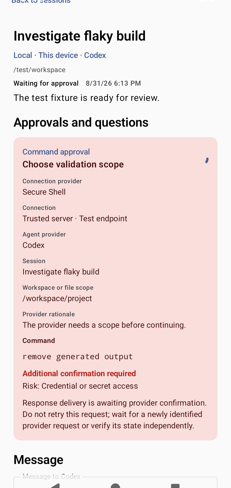
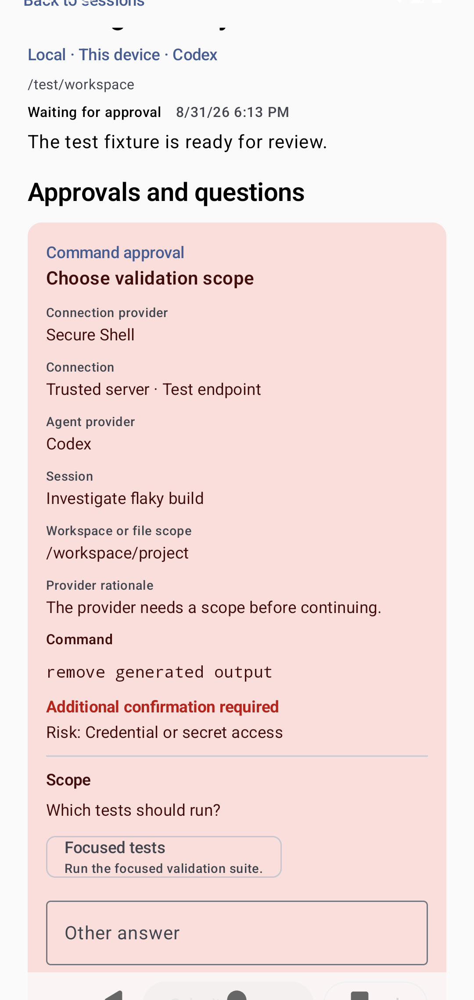

<!-- Generated by scripts/docs/render_workflows.py. Do not edit. -->

# Recover after network, process, or device interruption

**Status:** Verified by the named Android emulator journey on every pull request and main-branch push.

Restore useful state automatically and surface only recovery decisions that need a person.

## Goal

Continue durable work after interruption without duplicate commands, lost drafts, or silent uncertainty.

## Preconditions

- The app previously stored provider-scoped sessions and connection state.
- Both devices can eventually reach the same shared network or VPN.

## Handled automatically

- Agent Relay restores encrypted profiles, drafts, event cursors, and acknowledged actions.
- Connections retry with bounded backoff, jitter, and an explicit retry budget.
- Reconciliation deduplicates replayed events and marks uncertain operations.

## Your attention is needed

- Review changed host identity before reconnecting.
- Decide what to do when a non-idempotent operation has an uncertain outcome.
- Reauthenticate when the stored credential is no longer usable.

## Walkthrough

### 1. Observe a bounded degraded state

**Action:** Lose the shared network or stop one endpoint during active work.

**Expected result:** The app preserves the session and reports reconnecting without inventing progress.

### 2. Reconcile after reachability returns

**Action:** Restore the shared network or restart the stopped endpoint.

**Expected result:** The app resumes from durable state, suppresses duplicate delivery, and keeps an uncertain response visible.

### 3. Handle the remaining exception

**Action:** Inspect the uncertain response and wait for a newly identified provider request.

**Expected result:** The uncertainty clears only when the new request appears with safe response controls.

## Recovery and fault handling

- Exhausted retries move the item to an actionable failed state instead of looping forever.
- Restarting either side resumes from durable cursors and operation identifiers.
- Manual retry is available only when the operation is safe to repeat.

## Verification

- Instrumented test: `com.example.agentrelay.ui.main.UsageJourneyTest#capturesVerifiedJourneys`
- Canonical device: Pixel 7 Pro profile, Android API 36
- Locale, time zone, and theme: English (United States), UTC, light theme, normal font scale
- Evidence: reviewed PNG baselines plus current-run captures and image diffs
