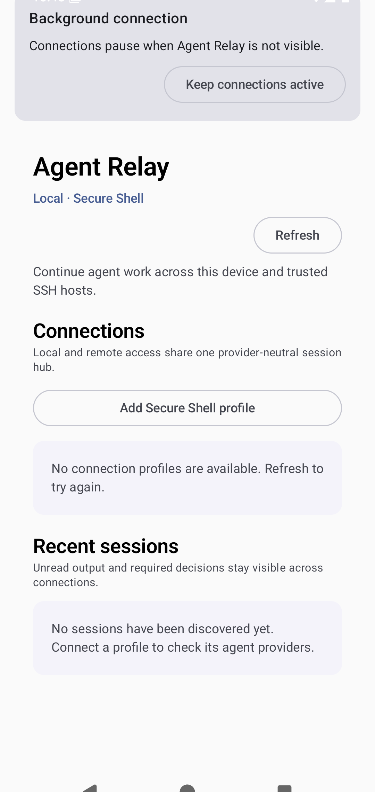
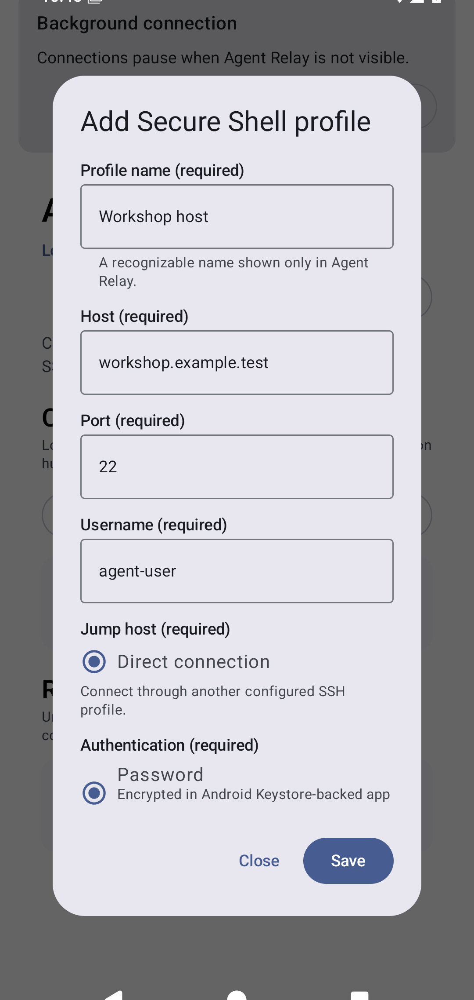
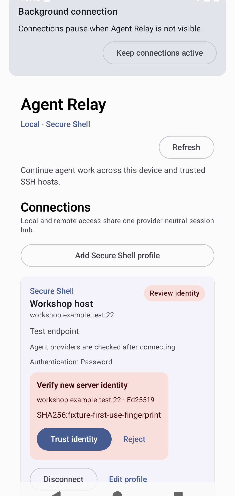
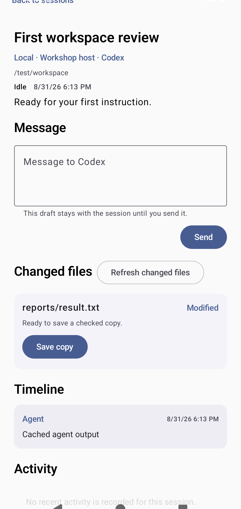

<!-- Generated by scripts/docs/render_workflows.py. Do not edit. -->

# Fresh start to first usable session

**Status:** Verified by the named Android emulator journey on every pull request and main-branch push.

Configure a secure host, review its identity, and open the first agent session.

## Goal

Reach a usable agent session from a clean app state without exposing credentials.

## Preconditions

- The app was installed with no saved remote connection profile.
- A synthetic Secure Shell fixture is available to the emulator.

## Handled automatically

- Agent Relay stores profile secrets in app-private encrypted storage.
- The connection provider probes supported agents after identity trust is established.
- A successful launch selects the new provider-scoped session.

## Your attention is needed

- Enter the intended host account and choose its authentication method.
- Compare the first-use host fingerprint with a trusted source before accepting it.
- Confirm the working directory and optional model before starting the session.

## Walkthrough

### 1. Open a fresh session hub

**Action:** Launch Agent Relay with no saved remote profile.

**Expected result:** The hub explains that no sessions exist and offers Secure Shell profile creation.

### 2. Enter the host profile

**Action:** Select Add Secure Shell profile and enter the synthetic account details.

**Expected result:** The editor shows host, port, username, jump-host, and authentication controls.

### 3. Review the first host identity

**Action:** Save and connect, then compare the displayed Ed25519 fingerprint.

**Expected result:** The connection stays blocked until the identity is trusted or rejected.

### 4. Open the first usable session

**Action:** Trust the verified identity, select the discovered agent, and start its session.

**Expected result:** A session detail view opens with timeline context and a usable message composer.

## Recovery and fault handling

- Correct highlighted fields without re-entering secrets that are already stored.
- Reject an unexpected fingerprint and verify the host outside Agent Relay.
- Reconnect the profile before retrying agent discovery or session launch.

## Verification

- Instrumented test: `com.example.agentrelay.ui.main.UsageJourneyTest#capturesVerifiedJourneys`
- Canonical device: Pixel 7 Pro profile, Android API 36
- Locale, time zone, and theme: English (United States), UTC, light theme, normal font scale
- Evidence: reviewed PNG baselines plus current-run captures and image diffs
