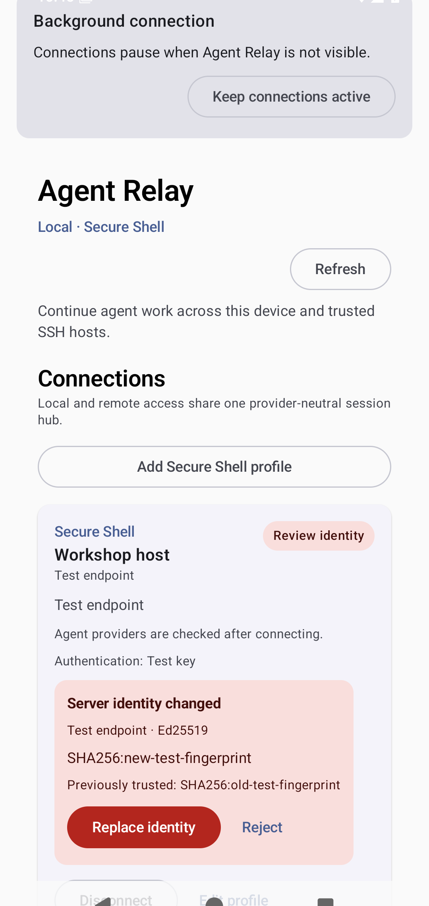
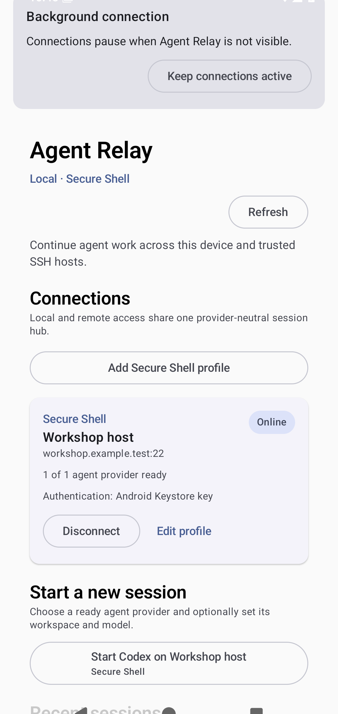

<!-- Generated by scripts/docs/render_workflows.py. Do not edit. -->

# Review an unknown or changed host identity

**Status:** Verified by the named Android emulator journey on every pull request and main-branch push.

Keep a remote connection closed until its cryptographic host identity is explicitly reviewed.

## Goal

Detect host replacement or interception before sending credentials or agent traffic.

## Preconditions

- A Secure Shell profile has attempted a connection.
- The presented fingerprint is unknown or differs from the stored fingerprint.

## Handled automatically

- Agent Relay stops the connection before authentication.
- The card shows the algorithm, endpoint label, current fingerprint, and prior fingerprints.
- Rejecting the identity leaves the saved trust record unchanged.

## Your attention is needed

- Verify the fingerprint through an independent trusted channel.
- Replace a changed identity only when the infrastructure change is expected.

## Walkthrough

### 1. Inspect both fingerprints

**Action:** Open the connection card after Agent Relay reports a changed host identity.

**Expected result:** The new and previously trusted fingerprints are visible before any decision.

### 2. Continue only after verification

**Action:** Select Replace identity after verifying the change through a trusted channel.

**Expected result:** The fixture connection becomes online and agent discovery can continue.

## Recovery and fault handling

- Reject the candidate when the change is unexplained.
- Reconnect after the remote administrator confirms the expected fingerprint.
- Investigate repeated changes outside the app before continuing.

## Verification

- Instrumented test: `com.example.agentrelay.ui.main.UsageJourneyTest#capturesVerifiedJourneys`
- Canonical device: Pixel 7 Pro profile, Android API 36
- Locale, time zone, and theme: English (United States), UTC, light theme, normal font scale
- Evidence: reviewed PNG baselines plus current-run captures and image diffs
