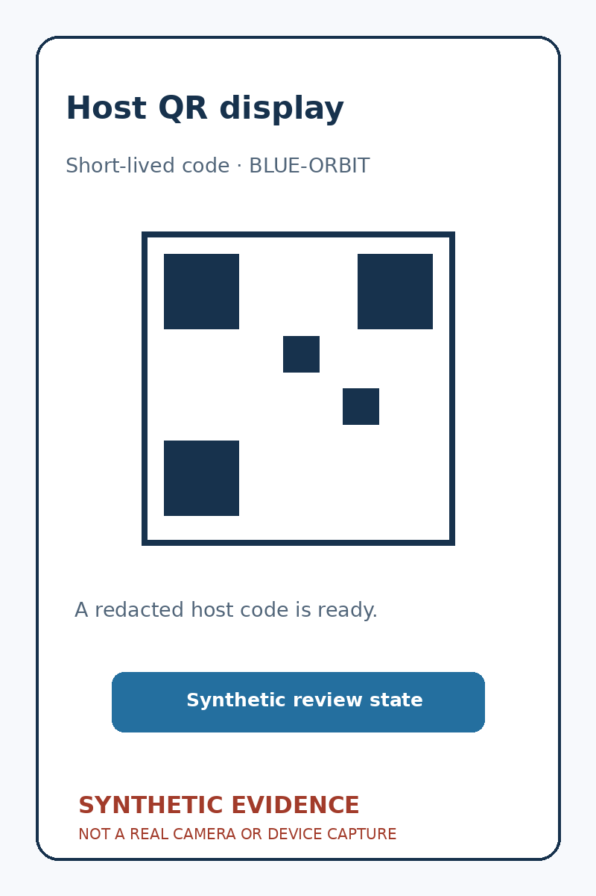
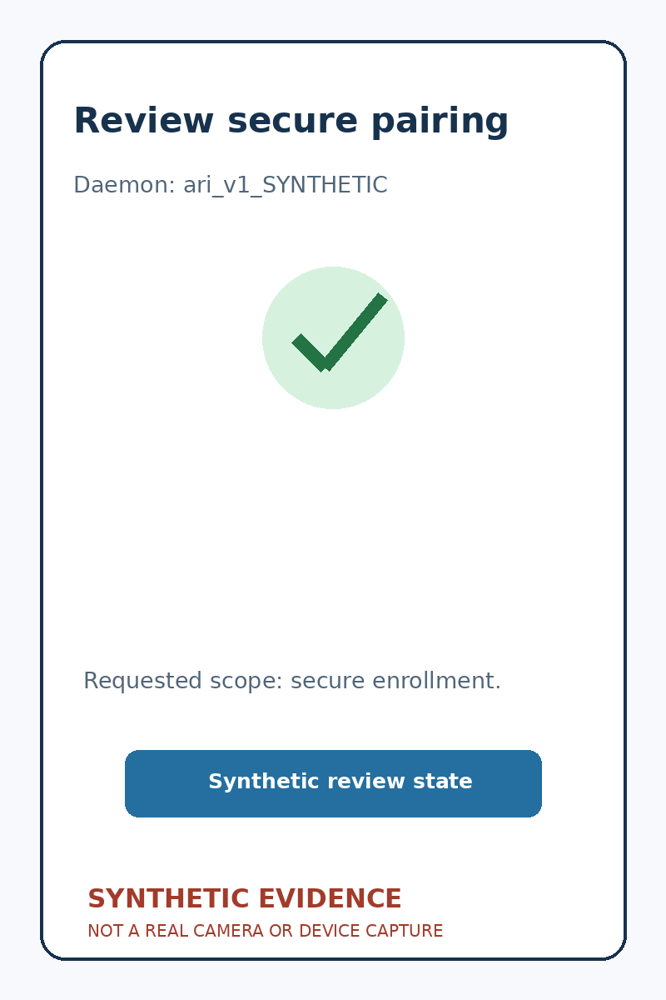
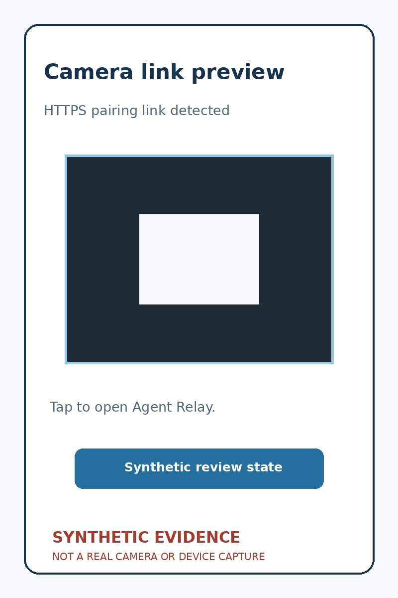
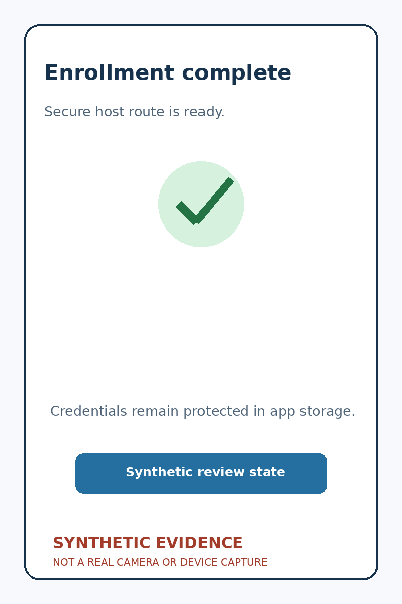
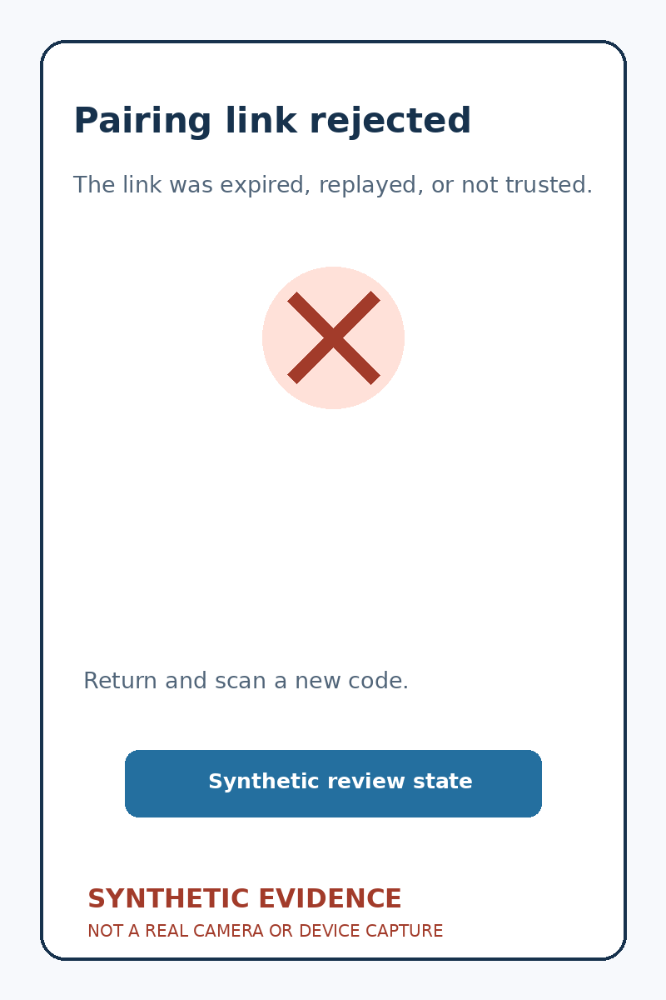

<!-- Generated by scripts/docs/render_workflows.py. Do not edit. -->

# Pair the phone with a durable host

**Status:** Verified from deterministic synthetic evidence under an explicitly documented temporary waiver. These redacted image files are not real camera or device captures.

Scan one host-generated QR code and establish an authenticated route when both devices share a network.

## Goal

Pair two devices that are not directly reachable from the internet with minimal manual setup.

## Preconditions

- The phone and host can both reach the same LAN, public rendezvous service, or VPN.
- The host daemon displays a short-lived, single-use pairing QR code.
- A camera may open the same code as a verified HTTPS App Link.

## Handled automatically

- The QR payload carries rendezvous information, protocol versions, and a pinned host identity.
- Both endpoints establish an encrypted channel and prove possession of their pairing keys.
- Successful pairing rotates bootstrap material into durable device credentials.
- Camera App Links and in-app scans use the same encrypted enrollment path.

## Your attention is needed

- Scan the QR code displayed by the intended host.
- If the camera opens a link, confirm the daemon identity and requested scope in Agent Relay.
- Compare the short authentication phrase on both devices when required.
- Name the paired host and approve its requested capabilities.

## Walkthrough

### 1. Display a short-lived host code

**Action:** Open pairing on the host daemon.

**Expected result:** The synthetic host fixture shows a QR code, expiry, and a human-readable authentication phrase.

### 2. Scan and verify

**Action:** Scan the code in Agent Relay and compare the authentication phrase.

**Expected result:** The synthetic app fixture shows both devices proving pinned identities before exchanging durable credentials.

### 3. Confirm a camera App Link

**Action:** Tap the camera preview link and review the verified daemon identity in Agent Relay.

**Expected result:** The synthetic camera-link fixture shows the verified HTTPS path; Agent Relay rejects an unverified, expired or replayed link and otherwise enters the same confirmation and probe path.

### 4. Confirm the paired host

**Action:** Name the host and approve the narrow capability set.

**Expected result:** The synthetic fixture shows the host becoming available through the best shared-network route.

### 5. Reject an invalid or expired link

**Action:** Return to the QR flow after an expired or replayed link is detected.

**Expected result:** Agent Relay rejects the link and explains that a new code is required.

## Recovery and fault handling

- Expired or consumed QR payloads cannot be replayed.
- A browser fallback never completes pairing and gives explicit return-to-app guidance.
- Failed relay paths fall back to other advertised transports without weakening identity checks.
- Removing a device revokes its durable credential without changing unrelated pairings.

## Verification

- Evidence mode: temporary synthetic-evidence waiver; not real camera/device verification
- Review manifest: `SyntheticQrWorkflowEvidence#reviewedFiveStates`
- Evidence: five deterministic redacted PNG review cards, explicitly labeled synthetic
