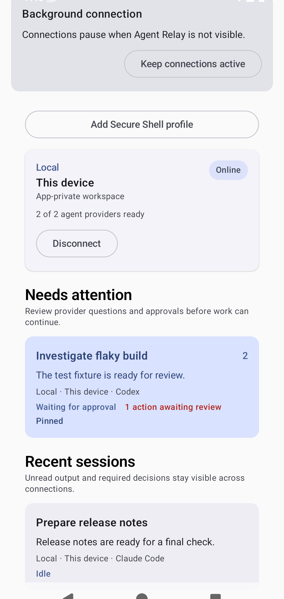
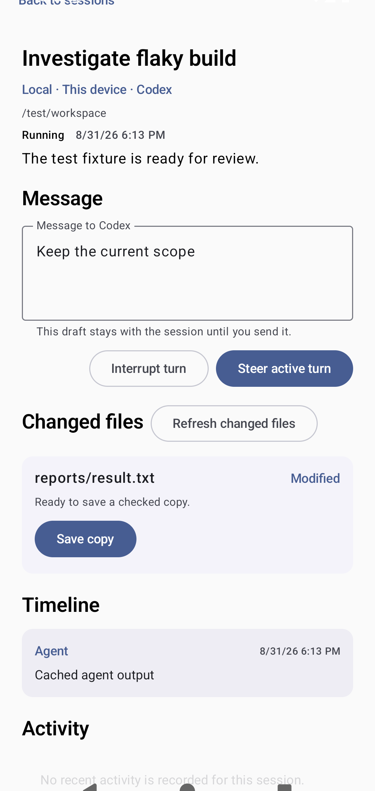

<!-- Generated by scripts/docs/render_workflows.py. Do not edit. -->

# Switch sessions and steer active work

**Status:** Verified by the named Android emulator journey on every pull request and main-branch push.

Move between concurrent sessions without losing drafts, unread state, or active-turn controls.

## Goal

Continue the right task while preserving context across several agent sessions.

## Preconditions

- At least two synthetic sessions exist on one or more connections.
- One session is running and advertises steering and interruption.

## Handled automatically

- Agent Relay keeps unread and attention counts with the complete session identity.
- Each session keeps its own encrypted draft and cursor selection.
- Available controls follow the provider-reported session state and capabilities.

## Your attention is needed

- Choose the session whose title, connection, provider, and workspace match the task.
- Use Steer active turn only when new guidance should affect the running turn.
- Use Interrupt turn when stopping the active operation is necessary.

## Walkthrough

### 1. Compare active sessions

**Action:** Review session titles, providers, unread counts, and attention badges.

**Expected result:** The list makes the task that needs attention distinguishable from quiet work.

### 2. Steer the selected running session

**Action:** Open the running task, edit its preserved draft, and review the available controls.

**Expected result:** Steer active turn and Interrupt turn are available for the capable provider.

## Recovery and fault handling

- Return to the session list when the selected task is wrong.
- A failed send keeps the draft and shows a sanitized error.
- Resume only when the provider advertises durable resume support.

## Verification

- Instrumented test: `com.example.agentrelay.ui.main.UsageJourneyTest#capturesVerifiedJourneys`
- Canonical device: Pixel 7 Pro profile, Android API 36
- Locale, time zone, and theme: English (United States), UTC, light theme, normal font scale
- Evidence: reviewed PNG baselines plus current-run captures and image diffs
