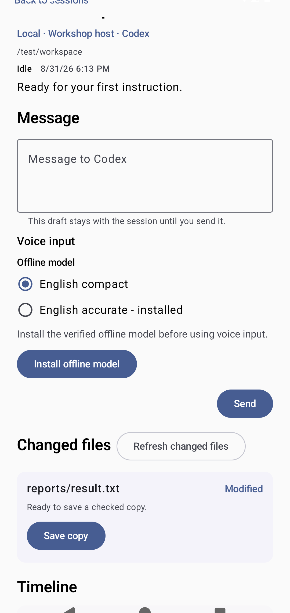
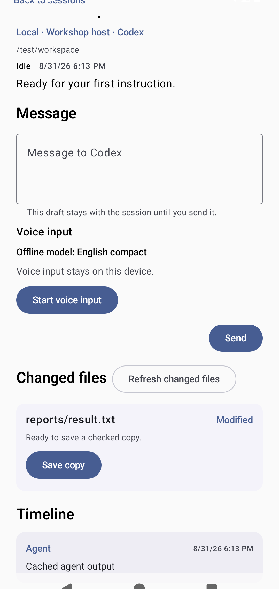
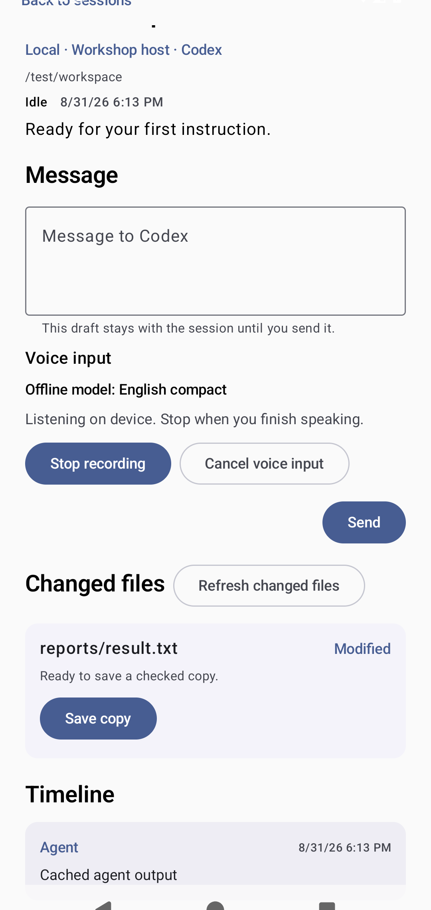
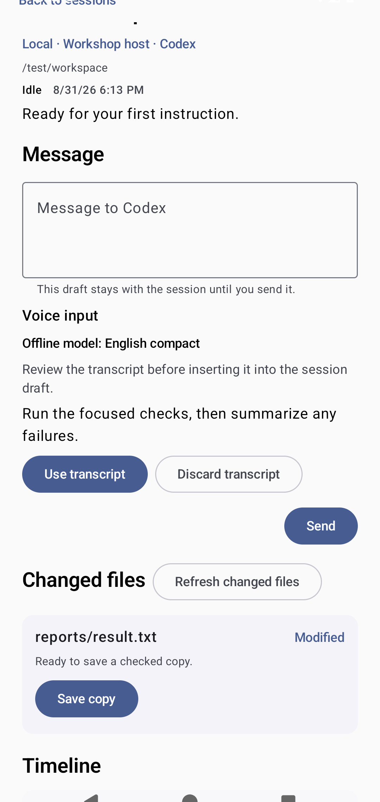

<!-- Generated by scripts/docs/render_workflows.py. Do not edit. -->

# Capture and review offline voice input

**Status:** Verified by the named Android emulator journey on every pull request and main-branch push.

Turn speech into a draft locally, then let the user review it before any agent receives it.

## Goal

Create session input hands-free without sending microphone data to a cloud service.

## Preconditions

- A compatible offline speech model is installed and verified.
- Microphone permission was granted for an explicit recording action.

## Handled automatically

- Agent Relay records only during a visible foreground capture.
- Offline transcription produces a session-local draft and preserves the existing cursor.
- Model acquisition verifies size, digest, provenance, and available storage.

## Your attention is needed

- Start and stop recording explicitly.
- Review and edit the transcript before sending or steering.
- Approve a model download when no verified local model is available.

## Walkthrough

### 1. Prepare an offline model

**Action:** Select voice input when no compatible verified model is installed.

**Expected result:** The app requires an explicit install for the selected offline model.

### 2. Authorize an explicit recording

**Action:** Select Start voice input for the current session.

**Expected result:** The app states that voice input stays on the device before Android handles microphone permission.

### 3. Record with visible control

**Action:** Start recording, speak the instruction, and stop recording.

**Expected result:** A foreground indicator remains visible and audio stays on the device.

### 4. Review before delivery

**Action:** Edit the generated draft and select Send or Steer active turn.

**Expected result:** Only the reviewed text reaches the selected agent session.

## Recovery and fault handling

- Interrupted capture leaves the previous draft intact.
- A failed model verification removes the unusable partial artifact.
- Denied microphone permission keeps keyboard input fully usable.

## Verification

- Instrumented test: `com.example.agentrelay.ui.main.UsageJourneyTest#capturesVerifiedJourneys`
- Canonical device: Pixel 7 Pro profile, Android API 36
- Locale, time zone, and theme: English (United States), UTC, light theme, normal font scale
- Evidence: reviewed PNG baselines plus current-run captures and image diffs
